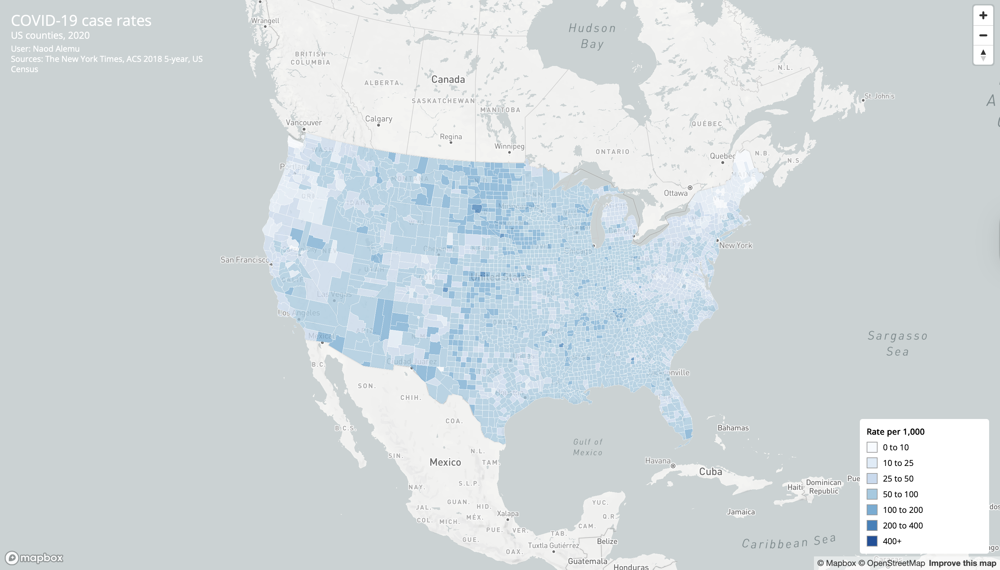
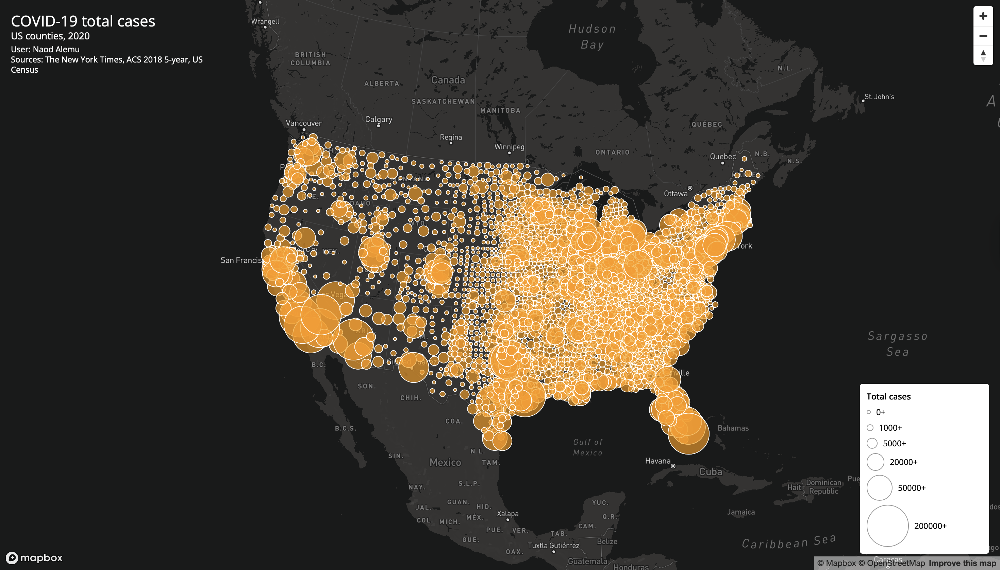

# covid-us-2020-maps

## Project Overview

This project presents two interactive web maps built with Mapbox GL JS that visualize COVID-19 data at the county level for the United States in 2020.

The first map displays COVID-19 case rates using a choropleth map.  
The second map displays total COVID-19 cases using proportional symbols.

Together, these maps allow users to explore the spatial distribution and intensity of COVID-19 across U.S. counties.

## Live Maps

Choropleth map (case rates):  
https://nalemu13.github.io/covid-us-2020-maps/map1.html

Proportional symbols map (total cases):  
https://nalemu13.github.io/covid-us-2020-maps/map2.html

## Screenshots

Choropleth map screenshot:

Proportional symbols map screenshot:

## Features

Both maps include:

- Interactive popups showing county-level data
- Legends explaining symbol meaning
- Titles and map descriptions
- Albers projection for U.S. mapping
- Custom styling using CSS
- Cleaned and simplified GeoJSON data

## Data Sources

COVID-19 case and death data:  
The New York Times COVID-19 dataset

Population data:  
U.S. Census Bureau (2018 ACS 5-year estimates)

County boundaries:  
U.S. Census Bureau

## Libraries and Tools Used

Mapbox GL JS  
https://docs.mapbox.com/mapbox-gl-js/

Mapshaper  
https://mapshaper.org/

GitHub Pages for hosting

## File Structure

map1.html  
map2.html  
readme.md  

assets/  
  us-covid-2020-rates.geojson  
  us-covid-2020-counts-points.geojson  

css/  
  style.css  

js/  
  main.js  

img/  
  map1.png  
  map2.png  

## Author

Name: Naod Alemu  
Course: GEOG 458  
University of Washington

## Acknowledgments

This project was completed as part of a web mapping lab assignment.  
Starter structure and datasets were provided through course materials.
